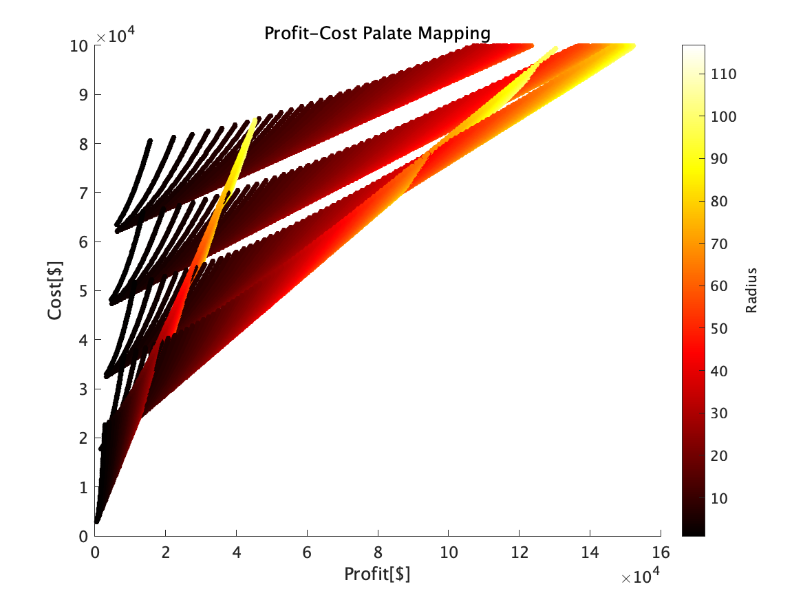
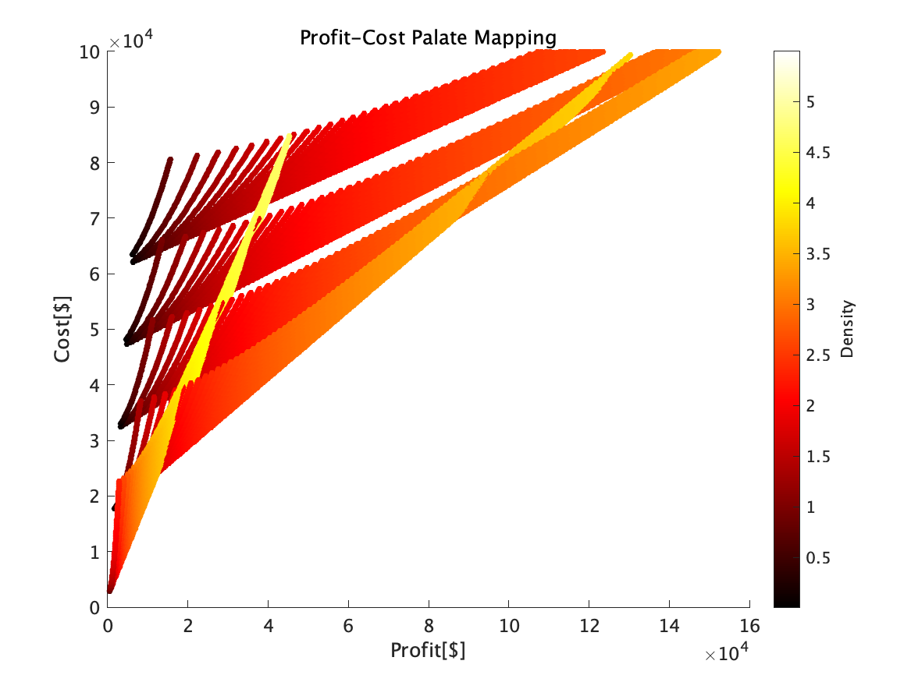

# Optimal System Design-12 Homework
## 1. Dairy Farm Problem
### 1.1 Problem Definition
- maximize Profit P
- Find the optimal 𝐿, 𝑅, and 𝑁, and the resulting profit 𝑃

### 1.2 Equation
### 1.3 Simulation Results
* Design parameter range
  * 1 < Length < 100m
  * 1 < Radius < 100m
  * 1 < Number of cows < 30

### 1.4 Optimization 
## 2. Todai Lecture Communication problem
### 2.1 Problem Definition
- capacity

- Incidence Matrix 

- Minimum Cost Flow Problem
- Find the optimal flow and the resulting cost!

### 2.2 Solution Algrism
- ネットワーク単体法
- 容量スケーリング法
- x = linprog(f,A,b,Aeq,beq) 
### 2.3 

