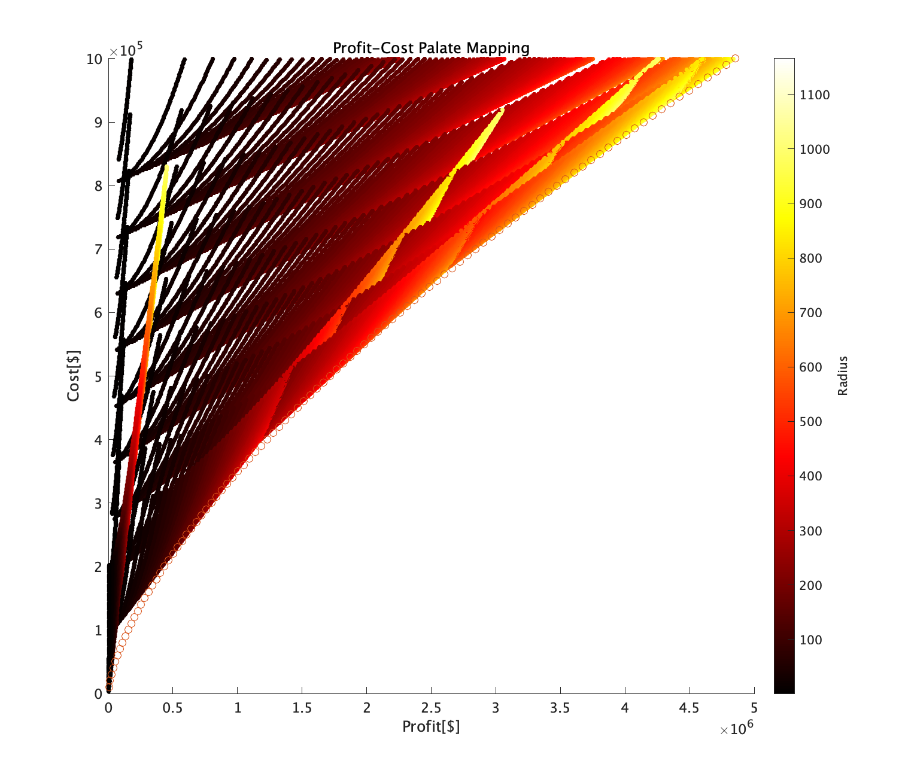

<script type="text/javascript" async src="https://cdnjs.cloudflare.com/ajax/libs/mathjax/2.7.7/MathJax.js?config=TeX-MML-AM_CHTML">
</script>
<script type="text/x-mathjax-config">
 MathJax.Hub.Config({
 tex2jax: {
 inlineMath: [['$', '$'] ],
 displayMath: [ ['$$','$$'], ["\\[","\\]"] ]
 }
 });
</script>

# Optimal System Design-12 HomeworkR,L_{side},N

Submitted on  January 17th.
## 1. Dairy Farm Problem
### 1.1 Problem Definition
- maximize Profit P
- Find the optimal 𝐿, 𝑅, and 𝑁, and the resulting profit 𝑃
  

<!--

-->
### 1.2 Equation
- define the equation of profit and cost

$$\begin{aligned}
 Profit &= 2MN \\
        &= 2 * 100\sqrt{A/N} * N \\
        &= 200  \sqrt{\frac{2RL_{side} + \pi R^2}{N}} N \\
        &= 200  \sqrt{RN(2L_{side} + \pi R)} &= f(R,L_{side},N) &=f(\boldsymbol{x})\\
 Cost &= 2000N + 100L_{circumference} \\
      &= 2000N + 100(2L_{side} + 2\pi R) \\
      &= 2000N + 200L_{side} + 200\pi R &= g(R,L_{side},N) &=g(\boldsymbol{x})
\end{aligned}$$

- Optimization problem is written as below

<div style="text-align: center;">

$\begin{array}{lc}
\text { Minimize: }   & \mathcal{J}=f(\boldsymbol{x}) \\ 
\text { subject to: } & g(\boldsymbol{x}) \leq 10^5 \\ 
\end{array}$

</div>

<!--
### 1.3 Theoretical approach
Length of the side can be calculated if maximum cost is defined as a costant value.
$$\begin{aligned}
2000N + 200L_{side} + 200\pi R &= C \\
                            L  &= C/200 - \pi R - 10N = g'(R,N)
\end{aligned}$$
Here we can modify objective function $f(x)$ as below

$$\begin{aligned}
\mathcal{J}=f(x) &=  f(R,N)
\end{aligned}$$
Now we can draw surface plot and find the maximum profit.


### ***Results***
There is slight errors caused by computation derivation.

- <u>Radius = 103.5 [m]
- Length = 4.8 [m]
- [#] of head = 17
- Profit = 1.5351 x 10^5 [$]</u>


### 1.3 Simulation Results
Here I investigated simulation analysis for understanding the model.
* Design parameter range
  * 1 < Length < 100m
  * 1 < Radius < 100m
  * 1 < Number of cows < 30


-->

### 1.4 最適化問題として解く
* 今回の問題は線形制約条件付き非線形最適化問題である
* fminconは非線形制約条件付き非線形最適化問題なので、若干オーバーキルなところがありそうだが
  * https://jp.mathworks.com/help/optim/ug/fmincon.html#busog7r-nonlcon
* 非線形制約条件付き非線形最適化問題とは

<div style="text-align: center;">

$\begin{array}{lcl}
\text { Minimize: }   & \mathcal{J}=f(x) &\\ 
\text { subject to: } & c(x) \leq 0 & 非線形制約条件(今回はない)\\
                      & c_{eq}(x) = 0 & 非線形等価条件(今回はない)\\
                      & A \cdot x \leq b & 線形制約条件(コスト関数)\\
                      & A_{eq} \cdot x = b_{eq} & 線形等価条件(今回はない)\\
                      & lb \leq x \leq ub & 上限下限(今回は下限のみ) \\
\text { definition: } & x &= (R,L_{side},N)^T\\
                      & f(x) &= 200  \sqrt{RN(2L_{side} + \pi R)} \\
                      & A \cdot x &= \begin{bmatrix} 200\pi & 0 & 0\\ 0 & 200 & 0 \\ 0 & 0 & 2000 \end{bmatrix}[R,L_{side},N]^T\\
                      & b &= 10^5 \\
                      & lb &= 0 \\
\end{array}$

</div>

* シミュレーション結果

```matlab
制約を満たす局所的最小値が見つかりました。

目的関数が最適性の許容誤差値の範囲内の実行可能な方向
において非減少であり、制約が制約の許容誤差値の範囲内で
満たされているため、最適化は完了しました。

x = 106.1011    0.0069   16.6667

ans = 1.5355e+05
```
* 感想
  * 牛の頭数は整数であるという条件をいれないといけない？
    * [MATLAB で離散刻みの変数に対​する最適化を行うには​どうすればよいですか​？](https://jp.mathworks.com/matlabcentral/answers/476961-matlab)
    * 基本的には、ga 関数の整数制約を利用して実装します。
  * 遺伝的アルゴリズムも使ってみる？

### 1.5 多段階決定問題として解く
* どうやら動的計画法という分野にそういう解き方があるらしい
* 一旦ためしに、コストを段階的に変えて最適化を回す
  * 制約条件をもつねに更新する
  * とりあえずシミュレータはできたが、どのように可視化するか
  * やはりパレートフロントをみたい
    * 今のままだと比較対象がない→とりあえず描こうよ
    * えい
    *   
    * 
  * 結果について
    * 段階的な制約の中で最適化した変数を引き継いでも次段階の最適性がたもたれた
  * 考察
    * 元々の想定がここで面白い結果になっていろいろ調べることを期待していた。
      * 簡単な数式だったから当然か
    * そういえば、想定される利益を最大化したいんじゃなかったっけか..?
      * そうだ、今のやり方だとちょっと違うな。た
      * ある段階において目標とする利益の中でコストを最小化する問題
      * 出てくる答えは変わらないかな...
    
  * 問題を変えてみてはどうか？→ 変えるくらいならコンステ最適化の問題を解きたい
  * ほかやりたいこと
    * 設計変数内でのパラメータの移動を知りたい
    * 

### 1.6 コンステレーション最適化問題を作る
* まずは物理モデルとして定式化する
* ここで

### 1.6 遺伝的アルゴリズムを実装してみる(可視化も気になる)
* [【MATLAB】遺伝的アルゴリズムを可視化する](https://qiita.com/motorcontrolman/items/6a52c722bd2314119b25)
* 


