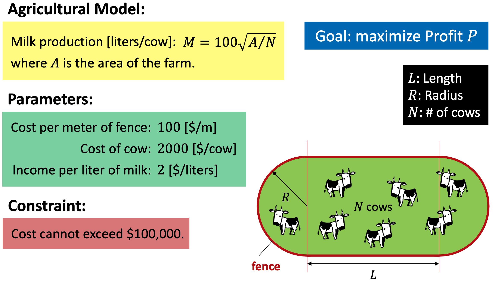
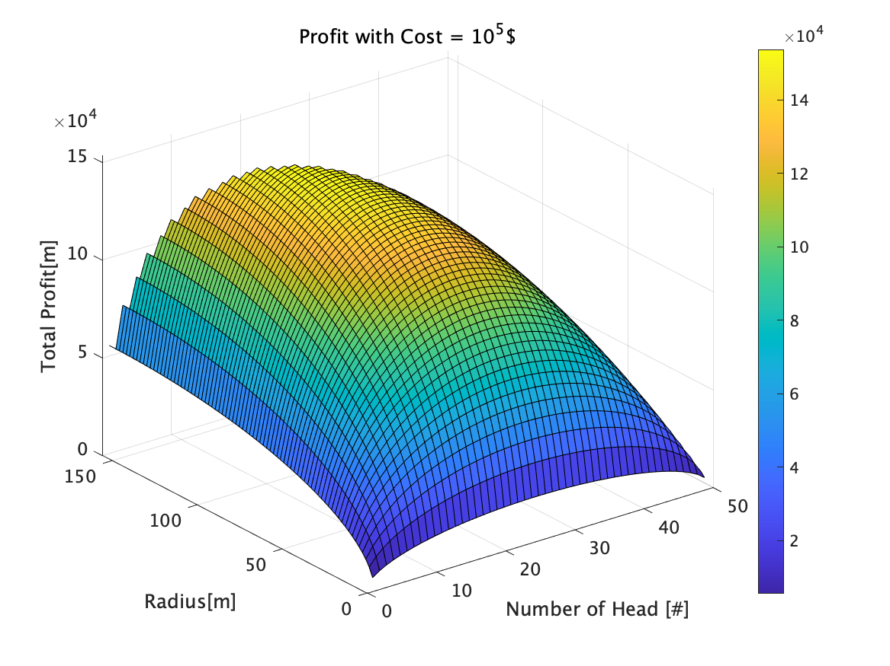
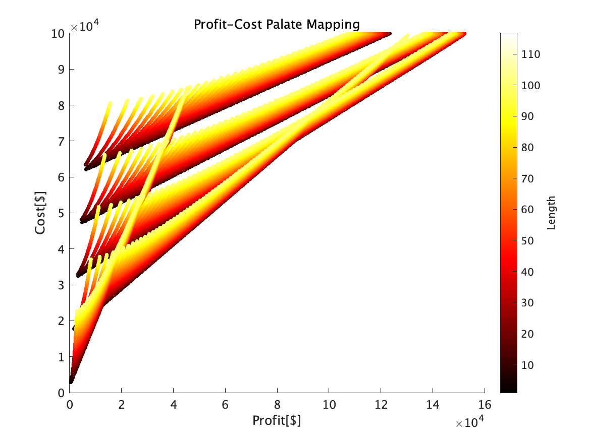
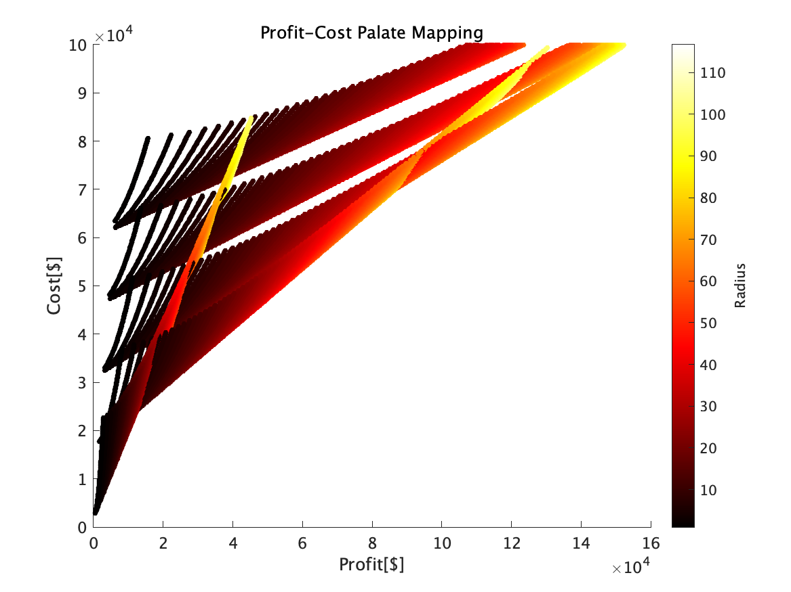
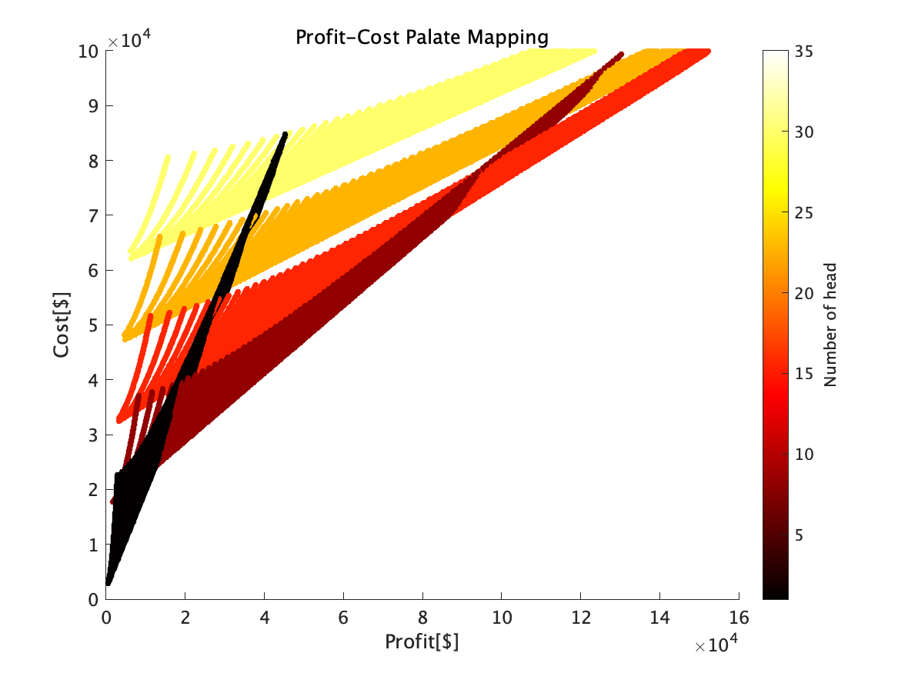
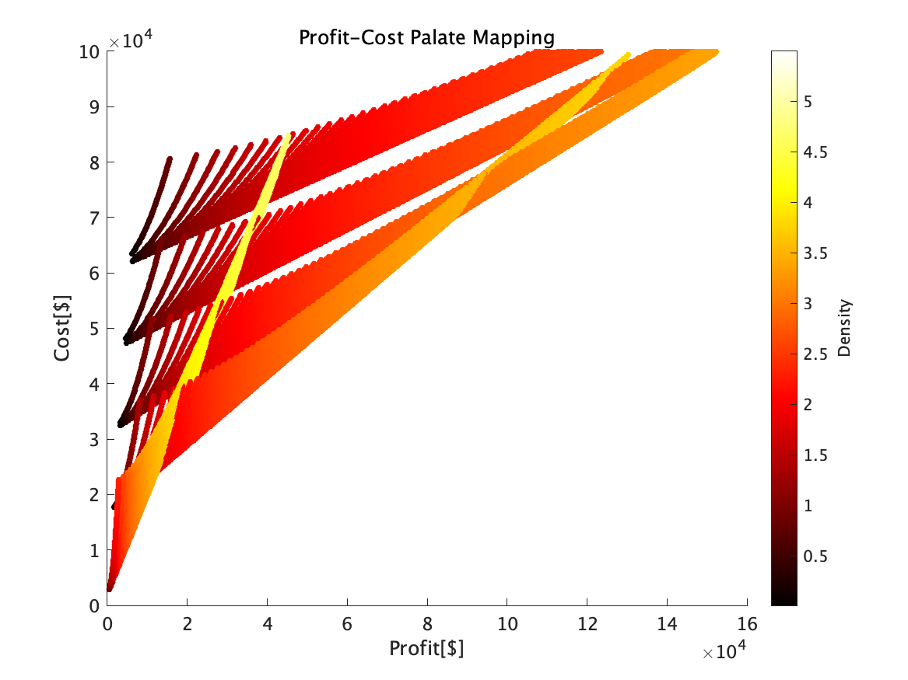
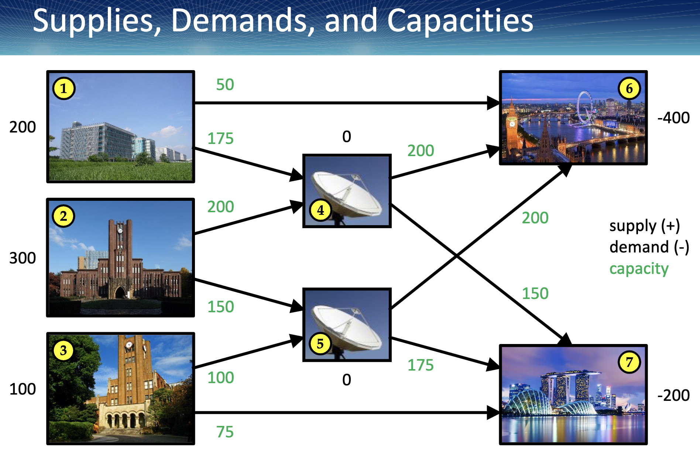
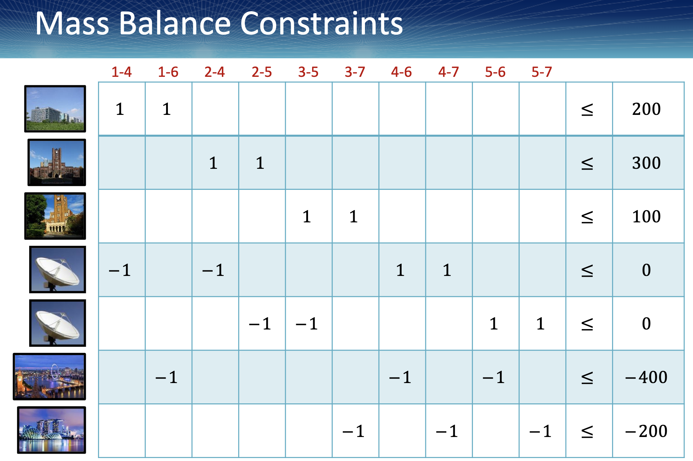
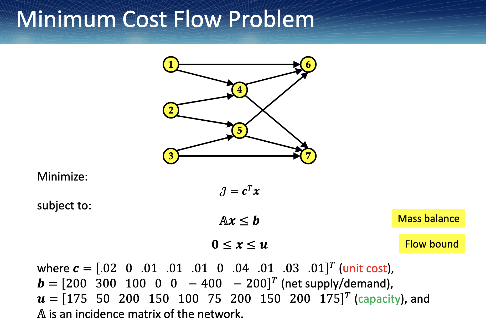

<script type="text/javascript" async src="https://cdnjs.cloudflare.com/ajax/libs/mathjax/2.7.7/MathJax.js?config=TeX-MML-AM_CHTML">
</script>
<script type="text/x-mathjax-config">
 MathJax.Hub.Config({
 tex2jax: {
 inlineMath: [['$', '$'] ],
 displayMath: [ ['$$','$$'], ["\\[","\\]"] ]
 }
 });
</script>

# Optimal System Design-12 Homework

Submitted on  January 17th.
## 1. Dairy Farm Problem
### 1.1 Problem Definition
- maximize Profit P
- Find the optimal 𝐿, 𝑅, and 𝑁, and the resulting profit 𝑃
  



### 1.2 Equation
- define the equation of profit and cost

$$\begin{aligned}
 Profit &= 2MN \\
        &= 2 * 100\sqrt{A/N} * N \\
        &= 200  \sqrt{\frac{2RL_{side} + \pi R^2}{N}} N \\
        &= 200  \sqrt{RN(2L_{side} + \pi R)} &= f(L_{side},R,N) &=f(\boldsymbol{x})\\
 Cost &= 2000N + 100L_{circumference} \\
      &= 2000N + 100(2L_{side} + 2\pi R) \\
      &= 2000N + 200L_{side} + 200\pi R &= g(L_{side},R,N) &=g(\boldsymbol{x})
\end{aligned}$$

- Optimization problem is written as below

<div style="text-align: center;">

$\begin{array}{lc}
\text { Minimize: }   & \mathcal{J}=f(\boldsymbol{x}) \\ 
\text { subject to: } & g(\boldsymbol{x}) \leq 10^5 \\ 
\end{array}$

</div>

### 1.3 Theoretical approach
Length of the side can be calculated if maximum cost is defined as a costant value.
$$\begin{aligned}
2000N + 200L_{side} + 200\pi R &= C \\
                            L  &= C/200 - \pi R - 10N = g'(R,N)
\end{aligned}$$
Here we can modify objective function $f(x)$ as below

$$\begin{aligned}
\mathcal{J}=f(x) &=  f(R,N)
\end{aligned}$$
Now we can draw surface plot and find the maximum profit.


### ***Results***
There is slight errors caused by computation derivation.

- <u>Radius = 103.5 [m]
- Length = 4.8 [m]
- [#] of head = 17
- Profit = 1.5351 x 10^5 [$]</u>


### 1.3 Simulation Results
Here I investigated simulation analysis for understanding the model.
* Design parameter range
  * 1 < Length < 100m
  * 1 < Radius < 100m
  * 1 < Number of cows < 30







### 1.4 Optimization Function
Future work. such as constraint optimization problem


## 2. Todai Lecture Communication problem
### 2.1 Problem Definition
- capacity

- Incidence Matrix 

- Minimum Cost Flow Problem
- Find the optimal flow and the resulting cost!

-->

### 2.2 Equation

<div style="text-align: center;">

$\begin{array}{lc}
\text { Minimize: }   & \mathcal{J}=\boldsymbol{c}^T \boldsymbol{x} \\ 
\text { subject to: } & \mathbb{A} \boldsymbol{x} \leq \boldsymbol{b} \\ 
                      & \mathbf{0} \leq \boldsymbol{x} \leq \boldsymbol{u}
\end{array}$

</div>

### 2.3 Computation method
- MATLAB
- x = linprog(f,A,b,Aeq,beq) 

```matlab
%% Initial Setting
c = [0.02, 0, 0.01, 0.01, 0.01, 0, 0.04, 0.01, 0.03, 0.01];
b = [200; 300; 100; 0; 0; -400; -200];
u = [175, 50, 200, 150, 100, 75, 200, 150, 200, 175];
A = [1, 1, 0, 0, 0, 0, 0, 0, 0, 0;
     0, 0, 1, 1, 0, 0, 0, 0, 0, 0;
     0, 0, 0, 0, 1, 1, 0, 0, 0, 0;
    -1, 0,-1, 0, 0, 0, 1, 1, 0, 0;
     0, 0, 0,-1,-1, 0, 0, 0, 1, 1;
     0,-1, 0, 0, 0, 0,-1, 0,-1, 0;
     0, 0, 0, 0, 0,-1, 0,-1, 0,-1];

options = optimoptions('linprog','Display','iter');

%% Calculation
x = linprog(c,A,b,[],[],u*0,u,options);
J = c * x;
x, J
```
we gained optimized solution.
x =[150
    ,50
   ,150
   ,150
    ,25
    ,75
   ,175
   ,125
   ,175
     ,0]


J = 19.7500


